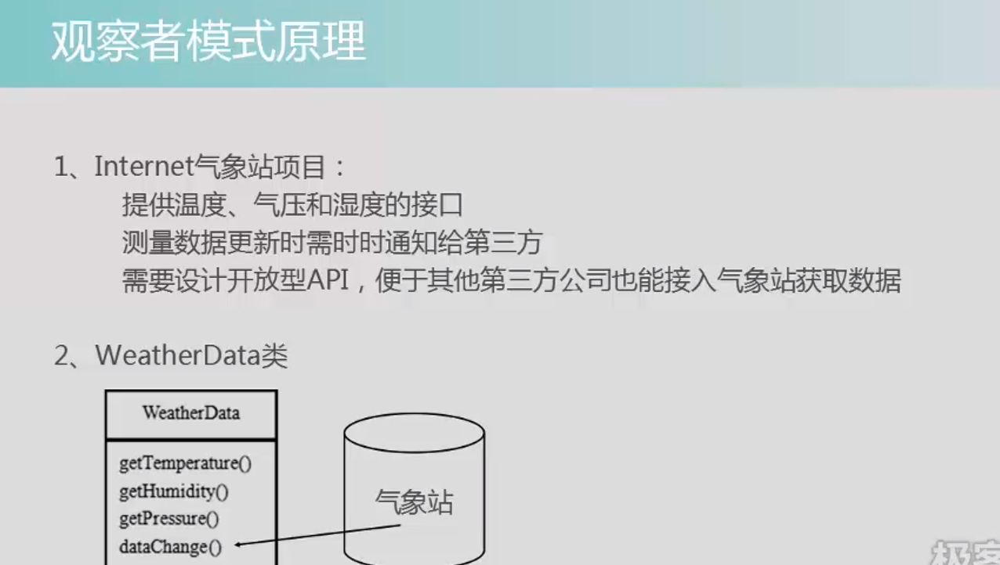

#观察者模式原理

目标与观察者质检的关系
一对 或 一对多

单向依赖，观察者依赖目标 目标不依赖观察者

####命名建议：
* 目标接口的订阅，间以在名称后面跟Subject
* 观察者接口的顶一，间以在名称后面跟Observer
* 观察者接口的更新方法，建议名称为update

#### 触发通知的时机:
* 在状态改变后通知

#### 观察者模式的调用顺序
#####准备阶段
* 创建目标对象
* 创建观察者对象
* 向目标对象注册观察者对象
#####运行阶段
* 1改变目标对象的状态
* 1.1 通知所有注册的观察者对象进行相应的处理
* 1.1.1 回调目标对象，获取相应的数据
###### 通知的顺序
* 多个观察者应该是平行的，不应该有相互依赖的关系

####种实现方式
* 推模型：相当于广播通信，主动向观察者推送目标信息，不管观察者是否需要，推动的信息通常是目标对象的全部或部分数据
* 拉模型：目标对象在通知观察者的时候只传递少量信息，如果观察者需要更具体的信息，由观察者主动到目标对象中获取，相当于是观察者从目标对象中拉数据。

 
 ######步骤